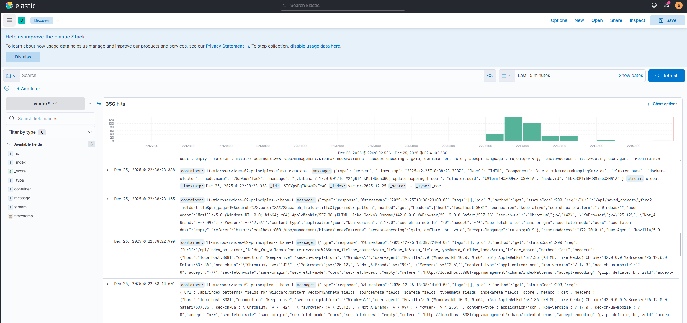

## Задание 1

Насколько я узнал, видимо, все можно сделать на сервисах gitlab. Там и, естественно, git и каждый сервис в отдельный репозиторий засунуть. Пайплайны там можно и автоматом по пушу запускать и ручками. Конфиги в ямликах вроде можно хранить на каждую сборку. И шаблоны сборок можно сделать на каждый сервис. Можно так сделать: .build_templ: script: - echo "some common things..." - mkdir ... - touch ...

а потом его использовать: job1: stage: build extends: .build_templ script: - echo "additional things for job1..."

Секреты тоже можно хранить в gitlab. Можно еще всякие hashicorp vault, но это если нужна какая то кастомная сложная настройка. Раннер можно у себя разворачивать. Сборки и тесты можно запускать разные одновременно. Тут образы хранить - GitLab Container Registry.

## Задание 2

Я предложу из задания со звездочкой. Три сервиса: Vector (собирает логи) > Elasticsearch (хранит логи) > Kibana (красиво показывает логи). Vector читает docker_logs, куда пишутся логи сервисов, кидает их в elasticsearch, а kibana в вебе показывает их.

## Задание 3

Prometheus (будет собирать и агрегировать метрики от хост сборщиков) + Grafana (покажет все красиво). На хостах можно установить node exporter, cAdvisor, service exporters (разные есть, в зависимости от сервисов - postgres, mysql, nginx). Ну и собствено: На каждом хосте ставится локальный сборщик чего-нибудь, к ним по ендпоинту (/metrics) цепляется прометеус забирает результат. Графана подключается к прометеусу и выводит красоту, где можно уже посмотреть циферки и диаграммы.

### Задание 4 со звездочкой

### Задание 5 со звездочкой
графана на 8082 порту будет
