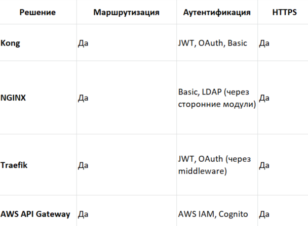
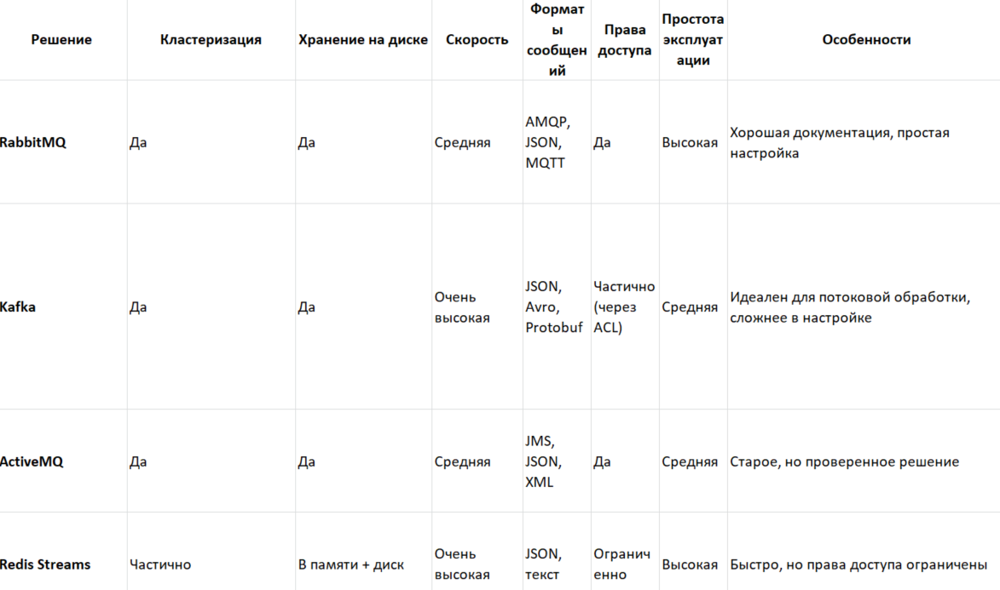
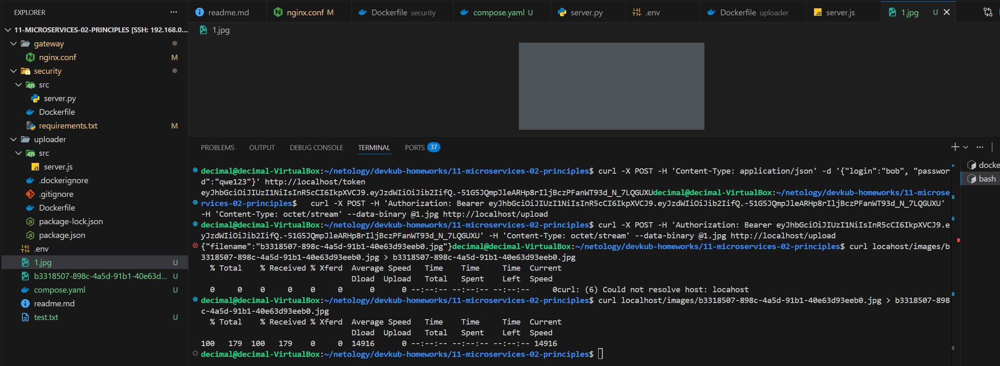

## Задание 1


Выбор:
Kong. Норм для корпоративной среды с маршрутизацией, аутентификации, терминaцией HTTPS и плагинами. хорошо подходит для интеграции с микросервисами в Kubernetes. Я честно говоря не знаю, почитал там сям, но  дипсики  мне сказали что: *"Traefik проще, но в больших корпоративных проектах функциональность плагинов и стабильность Kong предпочтительнее."*

## Задание 2
```bash
Я слышал только про rabbit и kaffka. Здесь, я чисто попросил сводную с выбором у дипсика и с выдержкой по каждому. Потом я выбрал на основе таблицы и мой выбор совпал с нейросетью: RabbitMQ — сбалансированное решение для корпоративной среды))
```


## Вот со * поинтересней задачка, жаль что не обязательная
### Задание со звездочкой
```bash
Все получилось, но потратил три вечера. Передалал компоуз немного.
у minio изменился синтаксис:
/usr/bin/mc alias set myminio http://storage:9000 ${Storage_AccessKey:-STORAGE_ACCESS_KEY} ${Storage_Secret:-STORAGE_SECRET_KEY} 
```

